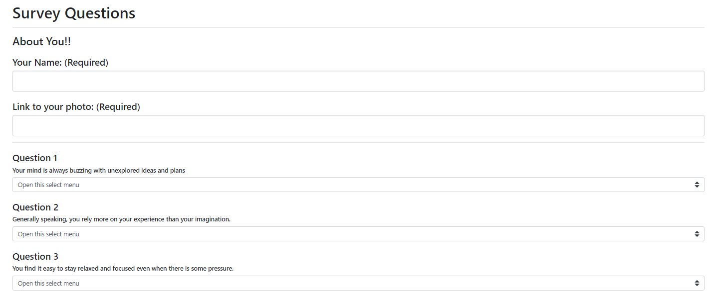

# Roomate-Finder-Express.js
Created during Week 13 of University of Washington Coding Bootcamp. The goal was to create a dating app but, I decide to make it Rommate finder, using Node and Express servers. The user enters the home page that had a buttom that take he/she to a survey page. When the user submits the survey, they are matched with a previous user that has the closest match to their personality.

# Heroku link
https://floating-savannah-40324.herokuapp.com/

# Screen Shots:

# Technologies used
* JavaScript
* Node.js
* Express.js
* Path
 
 # Author
 *Ray Wasif*

